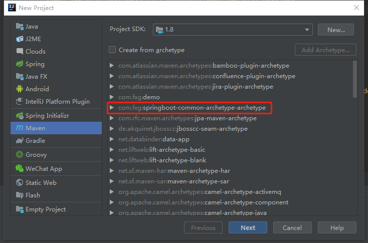

我在写一些练手项目的时候有很多代码是通用的，之前都是采用复制粘贴的手段从一个项目粘到另一个项目。
一直想建一个通用点的 maven 脚手架项目来代替这一操作，正好这两天有空，就付诸行动了。

## 项目结构

├─api
│      HttpResult.java     #统一的放回对象封装类
│      HttpStatus.java     #返回码常量类
│      
├─configs
│      ApiLogAspect.java                   #接口请求日志打印切面类
│      AutoEnumTypeHandler.java       #自定义的枚举转换器类
│      CacheManagerConfig.java         #单机缓存配置类
│      ExceptionHandlerAdvice.java      #统一异常捕捉配置
│      MyBatisPlusConfiguration.java    #MyBatisPlus 配置类
│      MyEnumTypeHandler.java          #自定义枚举转换器类转换方法具体实现类
│      MyTaskExecutorCustomizer.java  #Spring Boot 异步任务默认线程池配置类
│      WebConfig.java                       #Web配置类
│      
├─controller                    #Controller 层
│      UserController.java
│      
├─domain                 #domain 包
│      User.java
│     
├─enums                   #枚举包
│      BaseEnum.java
│      Gender.java
│     
├─exception                #异常信息封装相关类
│      ExceptionDescriptor.java
│      ExceptionSummary.java
│      StackSummary.java
│      
├─formatter                 #自定义 Formatter 包
│      DateFormatParser.java
│      DateFormatter.java
│      LocalDateFormatter.java
│      LocalDateTimeFormatter.java
│      LocalTimeFormatter.java
│      
├─mapper                  #mapper 层
│      UserMapper.java
│      
└─service                 #service 层 
        UserService.java

注：使用以下命令可以导出项目目录结构：

    tree  >> D:/tree.txt 只有文件夹
    tree /f >> D:/tree.txt 包括文件夹和文件
    

## 集成功能

### 通用接口返回对象封装类型

    统一返回结果格式，方便前端取用。

### 基于 AOP 的接口请求日志打印功能

    基于 AOP 实现，打印 Controller 接口的入参、执行结果、执行时间、异常原因、等信息。

### 自定义 MyBatis 枚举转换处理器

    mybatis 默认的枚举转换器是 org.apache.ibatis.type.EnumTypeHandler。
    EnumTypeHandler 能把枚举的名字映射成数据库的 CHAR 类型，如果需要其他的映射逻辑（比如将枚举的 value 映射成数据库的 int）就需要自己定义转换器。
    
    自定义转换器配置方式有三种：
    1. 在 application.yml 配置文件中配置：myybatis.configuration.default-enum-type-handler
    2. 在 mapper.xml 中的<result></result>中配置:
        <result column="gender" jdbcType="int" typeHandler="com.fxg.archetype.configs.MyEnumTypeHandler"></result>
    3. 在 mybatis 配置文件的 <typeHandlers></typeHandlers> 中配置
   
### 通用单机缓存

    这个之前写个一篇博客，不熟悉的可以看下：[Spring 基于注释的缓存框架](https://blog.fengxiuge.top/2020/2020-10-20-spring-cache.html)

### 统一异常捕捉

    借助 @RestControllerAdvice 注解实现的统一异常捕捉，封装异常信息，打印异常日志等。

### MyBatis-Plus 自动分页

    [MyBatis-Plus 分页查询文档](https://baomidou.com/guide/page.html)，

### ThreadPoolTaskExecutor 线程池

    启动类增加 @EnableAsync 注解后，spring 会自动创建此线程池，用来执行 @Async 方法。
    线程池参数可以在 spring.task.execution 下配置，
    也可以通过实现 org.springframework.boot.task.TaskExecutorCustomizer 接口的 void customize(ThreadPoolTaskExecutor taskExecutor) 方法来配置。

### 自定义的时间类 Formatter

    spring默认只能将格式为“yyyy/mm/dd”这样个是的日期字符串转化为 Java 的日期类，
    要实现其他样式的转化就要提供自定义的 Formatter

## TODO LIST

后续想到什么功能再往里加

## 安装 Archetype 步骤

1. 在项目目录执行命令：mvn archetype:create-from-project

2. 跳转到刚生成的 target\generated-sources\archetype 目录下执行命令 mvn install，将项目安装到本地 maven 仓库。

    注意：这一步 maven 会自动为项目名称追加 -archetype 后缀，后面用的时候别忘了。

3. 点击 IDEA 菜单 File->New->Project，打开创建 Maven 项目的页面，然后按下图操作。

4. 然后各种next，完成后会创建一个跟我们的脚手架项目结构一样的新项目，
并且我们的脚手架项目也在 Maven 脚手架列表中了。下次创建新项目就可以直接勾选了。

